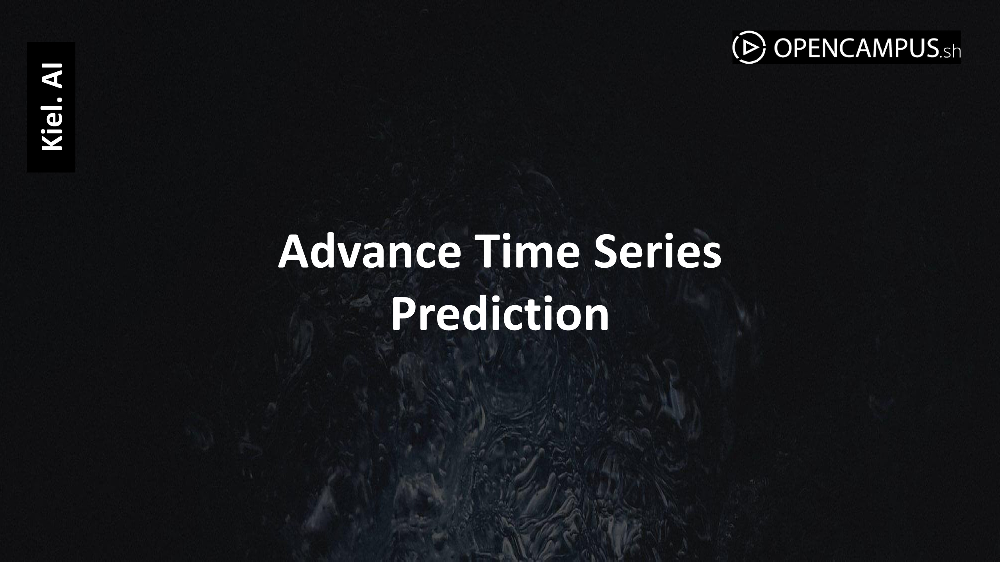

# Bitcoin Price Prediction
## Multivariate Time Series Prediction
### Using, (S)ARIMA(X), DCC-GARCH, BEK-GARCH, VEC-GARCH, Prophet, and LSTM Models

### Github Repository
  

### Group Members: 
[Hassan Absar](https://github.com/hassanabsarqaimkhani), [Khushi Kala](https://github.com/kalakhushi18), Tran Kim Ngan Nguyen, Tanishka Saha, Chetna Lourembam
________________________

### Description:

This project is part of the [**Advanced Time Series Prediction**](https://edu.opencampus.sh/en/course/488) course at [**OpenCampus**](https://opencampus.sh/). The primary goal is to conduct a comprehensive *Multivariate Time Series Analysis* to predict the daily closing price of Bitcoin, focusing on the influence of various economic, social, and sentiment-based factors.

### Project Objective

We aim to predict **Bitcoin’s daily closing prices** by examining the potential impact of multiple time series variables:

- **S&P 500 Closing Data**: to capture broader movements in organized capital market.
- **Inflation Rate**: to account for macroeconomic pressures arising from monetary policy.
- **Daily Treasury Rates**: representing economic stability indicator for the money market.
- **Bitcoin Daily Google Trends**: to gauge public interest.
- **Twitter Sentiments**: to assess social media sentiment around Bitcoin.
- **Holiday Indicator**: to consider public holidays and weekends as factors that might influence trading volume and price volatility.

### Task Type
Regression (specifically, a Multivariate Time Series Regression)

### Results Summary

| Technique/Model      | Accuracy | MSE  | F1-Score | RMSE | MAE |
|----------------------|----------|------|----------|------|-----|
| (S)ARIMA(X)          |          |      |          |      |     |
| DCC-GARCH            |          |      |          |      |     |
| BEK-GARCH            |          |      |          |      |     |
| VEC-GARCH            |          |      |          |      |     |
| Prophet              |          |      |          |      |     |
| LSTM (Vanilla)       |          |      |          |      |     |
| LSTM (Bidirectional) |          |      |          |      |     |
| LSTM (Attention)     |          |      |          |      |     |

### Documentation

1. [**Literature Review**](https://github.com/kalakhushi18/Advance-Time-Series-Prediction-W24/blob/main/0_LiteratureReview)
2. [**Dataset Characteristics**](https://github.com/kalakhushi18/Advance-Time-Series-Prediction-W24/tree/main/1_DatasetCharacteristics)
3. [**Data Engineering**](https://github.com/kalakhushi18/Advance-Time-Series-Prediction-W24/tree/main/2_DataEngineering)
4. [**Baseline Model**](https://github.com/kalakhushi18/Advance-Time-Series-Prediction-W24/tree/main/3_BaselineModel)
5. [**Model**](https://github.com/kalakhushi18/Advance-Time-Series-Prediction-W24/tree/main/4_Model)
6. [**Presentation**](https://github.com/kalakhushi18/Advance-Time-Series-Prediction-W24/tree/main/5_Presentation)
7. [**Streamlit Application**](https://github.com/kalakhushi18/Advance-Time-Series-Prediction-W24/tree/main/6_StreamlitApplication)
8. [**Cover Image**](https://github.com/kalakhushi18/Advance-Time-Series-Prediction-W24/tree/main/CoverImage)

### Cover Image

